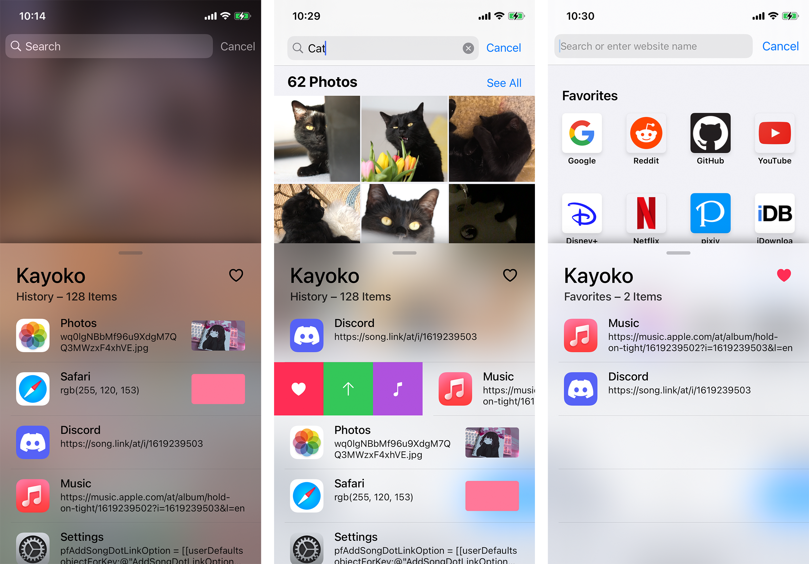

# Kayoko

Feature-rich clipboard manager for iOS.

This repository is the maintained Kayoko fork distributed by Lessica as `com.82flex.kayoko`. It is based on the archived GPLv3 Kayoko project originally created by Alexandra Aurora Göttlicher.

## Preview

## Installation

1. Download the latest `deb` from the [releases](https://github.com/OwnGoalStudio/Kayoko/releases).
2. Install the `deb` using your preferred method.

This package conflicts with and replaces the original `codes.aurora.kayoko` package. It is treated as a new package and does not migrate old preferences or history data.

## Source Code

The maintained source code is available at <https://github.com/OwnGoalStudio/Kayoko>.

The archived upstream project is available at <https://github.com/AlexandraAurora/Kayoko>.

## License

Kayoko is distributed under [GPLv3](COPYING). Paid distribution does not remove recipients' GPLv3 rights to copy, modify, and redistribute the software.

This maintained fork is not affiliated with or endorsed by the original author.
